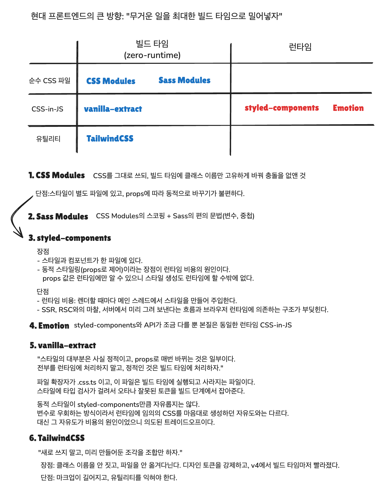

## 구현 결과

| | 강예령 | 남유성 |
|---|---|---|
| Step1 | [cactus-adv-1](https://github.com/pair-study/self-paced-react-advanced/tree/cactus-adv-1) , [PR #2](https://github.com/pair-study/self-paced-react-advanced/pull/2) | [hippo-adv-1](https://github.com/pair-study/self-paced-react-advanced/tree/hippo-adv-1) , [PR #1](https://github.com/pair-study/self-paced-react-advanced/pull/1) |
| Step2-1 |  |  |
| Step2-2 |  |  |
| Step2-3 |  |  |

---

## Step1
- styled-component 적용

### 미션 개요
- 핵심 키워드: `styled-component`

### 스터디 세션 기록
> 날짜: 2026.06.14 ~ 2026.06.16

### 공통으로 어려웠던 점

#### 1. 색상 변수 처리
하드코딩된 색상값은 반복 사용되는 항목만 `:root`의 CSS 변수로 추출해 정리했다.  
과제의 제약은 컴포넌트 스타일을 별도 CSS 파일에 남기지 않는 데 있다고 보고, 공통 토큰까지 만들지 말라는 의미로 해석하지는 않았다.  
그 결과 스타일 선언은 styled-components 안에 유지하면서도, 색상 값은 일관되게 관리할 수 있었다.

#### 2. 자식 선택자 중첩 vs 별도 컴포넌트 분리 기준
CSS Modules에서는 대부분의 요소가 클래스 단위로 분리되어 있었지만, styled-components에서는 자식 선택자를 중첩할지 별도 컴포넌트로 분리할지 직접 판단해야 했다.  
논의 끝에 아래 기준으로 정리했다.

| 기준 | 중첩 OK | 분리 권장 |
| --- | --- | --- |
| 스타일 복잡도 | 단순 (크기, 색상 1~2개) | 복잡한 스타일 블록 |
| 재사용 가능성 | 부모 없이 쓰일 일 없음 | 다른 곳에서도 쓰일 수 있음 |
| 조건부 스타일 | 없음 | props로 분기 필요 |
| 의미 전달 | 이름 필요 없음 | 이름이 코드 이해에 도움됨 |
| 선택자 정밀도 | 부모 안에 같은 태그가 더 생길 일 없음 | 같은 부모 안에 같은 태그가 더 생길 수 있음 |

### 서로 다르게 접근한 부분

#### 1. 필수 표시(`*`) 처리 — `styled(Component)` 확장 vs `props` 조건부

```tsx
// 유성 방식
const FormItem = styled.div`
  label {
    color: var(--grey-400);
  }
`;

const RequiredFormItem = styled(FormItem)`
  label::after {
    content: "*";
  }
`;

// 예령 방식
const FormItem = styled.div`
  label {
    color: var(--grey-400);
  }

  ${(props) =>
    props.$required &&
    `
      label::after {
        content: "*";
      }
    `}
`;
```

유성 방식은 의도가 명확하지만 변형이 늘수록 컴포넌트 수도 함께 늘어난다.  
예령 방식은 하나의 컴포넌트에서 변형을 관리할 수 있지만 조건이 많아지면 분기 로직이 길어진다.  
이번 미션에서는 `required`를 단순 on/off 성격의 변형으로 보고, 새 컴포넌트를 늘리기보다 `props` 조건부 방식이 더 적절하다고 정리했다.

#### 2. RestaurantList 구조 — `section` + `ul` 이중 구조 vs `ul` 단일 구조

```tsx
// 이중 구조
const ListContainer = styled.section`
  padding: 0 16px;
`;

const RestaurantUl = styled.ul``;

// 단일 구조
const List = styled.ul`
  padding: 0 16px;
`;
```

`section`은 영역의 의미를 더 분명히 보여주지만, 단순 레이아웃 목적이라면 구조만 불필요하게 늘어날 수 있다.  
이번에는 독립적인 섹션 의미보다 목록 자체가 핵심이라고 보고, 레이블 없는 `section` 대신 `ul` 단일 구조가 더 적절하다고 판단했다.

### 기술 선택과 트레이드오프
이번 미션은 CSS Modules로 작성된 스타일을 styled-components로 변환하는 과정이었다.  
CSS Modules는 클래스 이름 충돌을 막으면서도 구조가 단순하고 예측 가능하다는 장점이 있지만, 상태에 따라 스타일이 달라질 때는 클래스 조합이 늘어나기 쉽다.  
반면 styled-components는 컴포넌트와 스타일을 함께 두고 `props`로 조건부 스타일을 표현할 수 있어 응집도가 높고 읽기 흐름이 자연스럽다.  
대신 스타일을 어떤 단위로 나눌지, 단순 변형을 props로 둘지 컴포넌트로 분리할지처럼 설계 판단이 더 많이 필요했다.

| 항목 | CSS Modules | styled-components |
| --- | --- | --- |
| 스타일 작성 위치 | 별도 CSS 파일 | 컴포넌트 파일 내부 |
| 조건부 스타일 처리 | 클래스 조합 | props 기반 분기 |
| 장점 | 단순하고 예측 가능 | 응집도 높고 상태 표현이 직관적 |
| 트레이드오프 | 클래스 관리가 늘어날 수 있음 | 컴포넌트 경계와 변형 기준 설계 필요 |

<details>
<summary>확장 학습한 내용</summary>

#### 1. 빌드 타임 vs 런타임
최근 프론트엔드 스타일링은 런타임에서 처리하던 비용을 가능한 한 빌드 타임으로 옮기는 방향으로 발전하고 있다.  
정적인 스타일은 미리 계산해 두고, 런타임에는 꼭 필요한 동적 처리만 남기는 방식이 성능과 예측 가능성 면에서 유리하다.

#### 2. CSS Modules / Sass Modules
CSS Modules는 CSS를 거의 그대로 유지하면서 클래스 이름 충돌만 방지해 주는 방식이다.  
Sass Modules는 여기에 변수, 중첩 같은 Sass 문법을 더해 조금 더 편하게 스타일을 관리할 수 있다.

#### 3. styled-components / Emotion
둘 다 대표적인 런타임 CSS-in-JS 도구로, 컴포넌트 안에서 스타일을 선언하고 props 기반 분기를 처리하기 쉽다.  
대신 스타일 생성이 런타임에 일어나므로, 최근의 빌드 타임 중심 흐름과는 다소 반대편에 놓인다.

#### 4. vanilla-extract / TailwindCSS
vanilla-extract는 TypeScript 기반으로 스타일을 작성하되 결과물은 빌드 타임에 추출하는 방식이다.  
TailwindCSS는 미리 정의된 유틸리티 클래스를 조합하는 방식으로, 런타임 스타일 생성 없이 빠르게 일관된 UI를 만들 수 있다.



</details>

---

## Step2-1
- 
- 

### 미션 개요
- 핵심 키워드: 

### 스터디 세션 기록
> 날짜: 

### 공통으로 어려웠던 점


### 서로 다르게 접근한 부분


### 인상 깊었던 코드

**강예령**


**남유성**


  ---

## Step2-2
- 
- 

### 미션 개요
- 핵심 키워드:

### 스터디 세션 기록
> 날짜: 

### 공통으로 어려웠던 점

### 서로 다르게 접근한 부분

