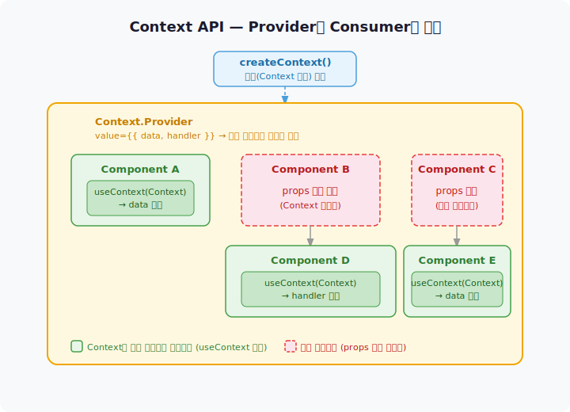

# 전역상태관리 - Context API

## 🎯 개인 목표 및 목표 달성을 위한 행동 가이드

이번 미션을 통해 다음과 같은 학습 경험들을 쌓는 것을 목표로 한다.

- 현재 코드에서 props drilling이 어디서 발생하는지 직접 찾아보고, Context API가 이를 어떻게 해소하는지 체감한다.
- `createContext`, `Provider`, `useContext`의 역할과 데이터 흐름을 이해하고, 세 요소가 어떻게 연결되는지 스스로 설명할 수 있는 수준으로 익힌다.
- Context API를 쓰는 것이 적절한 상황과 그렇지 않은 상황(trade-off)을 이해하고, 그 판단 근거를 PR에 직접 서술한다.
- 컴포넌트와 Context 간의 관계를 도식화해보며 데이터 흐름을 시각적으로 이해하는 경험을 쌓는다.

## 📝 기능 구현 목록

- `RestaurantContext` 생성 — `newRestaurants`, `registerRestaurant`, `isLoading`, `error` 관리
- `RestaurantProvider`를 `main.jsx`에서 감싸는 구조로 구현
- `useRestaurantContext` 커스텀 훅 분리 (null guard 포함)
- Context와 props 역할 분리
  - `RestaurantList` — Context에서 서버 데이터, props로 `selectedCategory`, `onRestaurantClick`
  - `AddRestaurantModal` — Context에서 `registerRestaurant`, props로 `onClose`
  - `CategoryFilter` — props로 `category`, `onCategoryChange`
- `App.jsx` — UI 상태(`selectedCategory`, `clickedRestaurant`, `isAddModalOpen`) 로컬 관리

## 📚 학습 내용

### 1. props drilling

props drilling은 데이터가 필요하지 않은 중간 컴포넌트들이 아래로 전달하기 위해 props를 받아야 하는 상황이다. 컴포넌트 트리가 깊어질수록 불필요한 의존이 쌓여 유지보수가 어려워진다.

### 2. Context API의 세 요소

| 요소 | 역할 |
| --- | --- |
| `createContext()` | 데이터를 담을 통로(Context 객체)를 만든다. 별도 파일에서 한 번만 생성하고 export한다 |
| `<Provider value={...}>` | 감싼 하위 컴포넌트 전체에 데이터를 공급한다. value가 바뀌면 이 Context를 구독하는 모든 컴포넌트가 리렌더링된다 |
| `useContext(Context)` | 필요한 컴포넌트에서 중간을 거치지 않고 직접 데이터를 꺼낸다 |

### 3. Context를 사용할 기준

처음에는 `RestaurantContext`와 `ModalContext` 두 개를 만들었다. `RestaurantContext`에는 레스토랑 데이터와 카테고리 필터 상태를, `ModalContext`에는 모달 열림/닫힘과 선택된 레스토랑 같은 UI 상태를 올렸다. App의 역할 과부하를 해소하는 것이 목표였다.

이후 "이 상태가 바뀌면 어떤 컴포넌트가 영향을 받는가"와 "공통 조상까지의 거리"를 기준으로 다시 검토했다.

| 상황 | 적합한 위치 |
| --- | --- |
| 여러 컴포넌트가 같은 데이터를 필요로 함 | Context |
| 공통 조상이 너무 높아 drilling이 길어짐 | Context |
| 공통 조상이 바로 위에 있음 | props |
| 특정 컴포넌트 하나만 사용 | 로컬 state |

이 기준으로 보면 이번 앱에서 Context가 진짜 필요했던 건 `registerRestaurant` 하나다. `newRestaurants`, `isLoading`, `error`는 여러 컴포넌트가 공유하는 서버 데이터라 Context가 적합하고, UI 상태(`clickedRestaurant`, `isAddModalOpen`, `selectedCategory`)는 App 직접 자식에게 props로 전달하면 충분했다.

### 4. Provider 위치 — main.jsx vs App.jsx

Provider를 렌더링하는 컴포넌트는 그 Provider의 소비자가 될 수 없다. `useContext`는 자신보다 상위에 있는 Provider를 찾기 때문이다.

| 위치 | 장점 |
| --- | --- |
| `main.jsx` | App도 Context 소비 가능, 확장에 유연함 |
| `App.jsx` return 안 | Provider 스코프가 명확함 |

App이 Context를 소비하지 않는 구조라면 `App.jsx` 안에 두어도 동작하지만, 확장성을 고려해 `main.jsx`에 뒀다. 앱 진입점에서 Provider를 선언적으로 관리하는 것이 역할 분리도 명확하다.

> 과거 미션 코드는 Provider를 `App.jsx` 안에 뒀는데, App이 Context를 소비해야 했기 때문에 JSX를 `AppContent`로 별도 분리해야 했다. Provider를 `main.jsx`로 올리면 이 문제가 해소되고 `AppContent`도 불필요해진다.

### 5. styled-components 선언 위치

styled-components를 컴포넌트 함수 아래에 선언해도 동작한다. `const`는 호이스팅되지 않지만, 컴포넌트 함수가 실제로 호출(React 렌더링)되는 시점에는 모듈 최상위 코드가 이미 전부 실행된 이후라 아래 있는 styled-components도 초기화된 상태이기 때문이다. 이 특성을 활용해 파일 상단에는 컴포넌트 로직을, 하단에는 styled-components를 배치하면 가독성이 좋아진다.

### 6. Context API와 컴포넌트 관계 도식화



## 🤔 고민했던 문제와 해결 과정에서 배운 점

### 1. props drilling 없이 Context를 도입한 이유 — App의 역할 과부하

코드를 보면서 props drilling을 찾으려 했지만 찾을 수가 없었다. 현재 트리가 얕아서 App의 모든 자식이 App에서 직접 props를 받고 있었고, 중간에 그냥 전달만 하는 컴포넌트가 없었다.

대신 다른 문제가 보였다. App.jsx가 상태 3개, 핸들러 6개, 필터 계산 로직까지 전부 들고 있었다. Context API가 props drilling만을 해결하기 위한 도구가 아니라는 걸 알았다. 관심사를 분리해 App을 가볍게 만드는 것도 Context를 도입하는 이유가 될 수 있다. 다만 모든 상태를 Context로 올리는 방식은 Context의 특성을 고려하지 않은 선택이었다. Context는 value가 바뀌면 구독하는 모든 컴포넌트가 리렌더링되기 때문에, UI 상태를 Context에 올리면 관련 없는 컴포넌트까지 불필요하게 리렌더링되는 문제가 생긴다.

### 2. Context 구독의 리렌더링 문제

초기 구현에서는 UI 상태(`clickedRestaurant`, `isAddModalOpen`)와 핸들러들을 `ModalContext`에 올렸다. Context value가 바뀌면 구독하는 모든 컴포넌트가 리렌더링된다.

`isAddModalOpen`이 `false → true`로 바뀔 때(모달 열기):

| 컴포넌트 | 구독 중인 값 | 리렌더링 필요 여부 |
| --- | --- | --- |
| `App` | `isAddModalOpen` | ✓ 필요 (조건부 렌더링) |
| `Header` | `handleAddModalOpen` | ✗ 불필요 |
| `RestaurantList` | `handleRestaurantClick` | ✗ 불필요 |

`Header`와 `RestaurantList`는 모달 열림과 관련 없는데도 `ModalContext`를 구독하고 있어 함께 리렌더링됐다. React DevTools의 "Highlight updates when components render" 옵션으로 직접 확인했다.

Context는 value 전체가 바뀌면 구독 컴포넌트 전체가 반응하는 구조라, 상태를 잘게 쪼개거나 구독 범위를 최소화하지 않으면 불필요한 리렌더링이 생긴다.

### 3. react-refresh 경고와 훅 파일 분리

Context 파일에서 Provider(컴포넌트)와 커스텀 훅(일반 함수)을 함께 export하면 `react-refresh/only-export-components` 경고가 발생한다.

> **핫 리로드** — 파일을 저장했을 때 페이지 전체를 새로고침하지 않고 변경된 컴포넌트만 교체해 업데이트하는 기능. React Fast Refresh는 컴포넌트 export만 있는 파일에서 핫 리로드를 안정적으로 처리하는데, 일반 함수가 섞이면 판단하지 못해 경고가 발생한다.

`useRestaurantContext.js`를 별도 파일로 분리해 Context 파일은 Provider 컴포넌트만, 훅 파일은 `useContext` 래퍼만 export하는 구조로 해결했다.

## 🛠 리팩토링

### 1. Provider를 main.jsx로 이동

`main.jsx`에서 Provider를 감싸도록 변경해 App.jsx는 레이아웃 구조에만 집중하도록 했다.

### 2. createContext(null) + 방어 로직 추가

`createContext(null)`로 초기화하고, 커스텀 훅 안에서 Provider 바깥 사용 시 에러를 던지도록 추가했다.

```jsx
export function useRestaurantContext() {
  const context = useContext(RestaurantContext);
  if (context === null) {
    throw new Error("useRestaurantContext는 RestaurantProvider 내부에서만 사용할 수 있습니다.");
  }
  return context;
}
```

### 3. ModalContext 제거

초기 구현에서 ModalContext는 App의 역할 과부하를 줄이기 위해 만들었다. 하지만 drilling 기준으로 보면 ModalContext의 모든 상태는 App 직접 자식에게 props로 전달하면 충분했다. 또한 ModalProvider가 내부에서 `useRestaurantContext()`를 호출해 Provider 중첩 순서가 암묵적 제약이 된다는 팀원 리뷰를 받았다. ModalContext 자체를 제거하고 UI 상태를 App 로컬로 되돌리는 방식으로 두 문제를 함께 해소했다.

### 4. RestaurantContext 축소

초기 RestaurantContext는 `category`, `filteredRestaurants`, `handleSelectChange`까지 포함하고 있었다. 이것들도 App 직접 자식에게 전달하는 값이라 props로 충분했다. 서버 데이터(`newRestaurants`, `registerRestaurant`, `isLoading`, `error`)만 남기고, category는 App 로컬 state로, 필터링 계산은 RestaurantList 내부로 이동했다.

## 과거 코드와 비교

### 달라진 점

**Provider 위치와 AppContent 분리**

과거 코드는 Provider를 `main.jsx`에서 감쌌다. App이 Provider 안에 있어서 App에서 바로 Context를 소비할 수 있었고, AppContent 분리가 불필요했다.

현재 코드도 `main.jsx`에 두는 방향으로 리팩토링했다. App.jsx는 레이아웃 구조에 집중하고, Provider는 앱 진입점에서 선언적으로 관리하는 것이 역할 분리가 명확하다.

**훅 파일 위치**

과거 코드는 커스텀 훅을 `src/hooks/` 폴더에 뒀다. 현재 코드는 `src/context/` 안에 뒀다.

`src/hooks/`는 모든 커스텀 훅을 한 곳에서 찾을 수 있다는 장점이 있고, `src/context/`는 Context와 훅을 한 묶음으로 관리해 응집도가 높다는 장점이 있다. Context에 강하게 종속된 훅이라는 점에서 `src/context/`를 유지하기로 했다.

### 과거 코드에서 배운 점

**`createContext(null)`과 방어 로직**

과거 코드는 `createContext()`에 초기값을 넣지 않았는데, 리뷰에서 `createContext(null)`로 선언하는 것을 권장한다는 피드백을 받았다.

`createContext()`에 아무것도 넣지 않으면 Provider로 감싸지 않은 컴포넌트에서 사용해도 조용히 기본값(`undefined`)으로 동작해 문제를 놓칠 수 있다. `null`로 초기화하고 커스텀 훅 안에서 방어 로직을 추가하면 Provider 바깥에서 사용했을 때 명시적인 에러가 발생해 디버깅이 쉬워진다.
